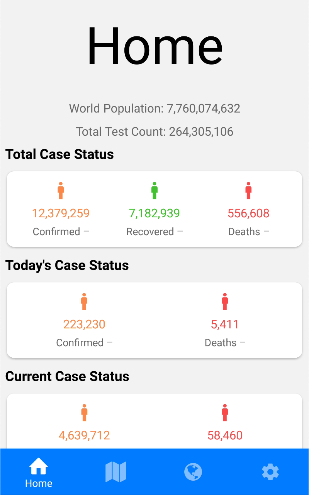
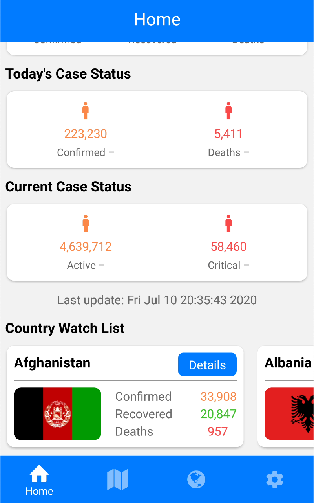
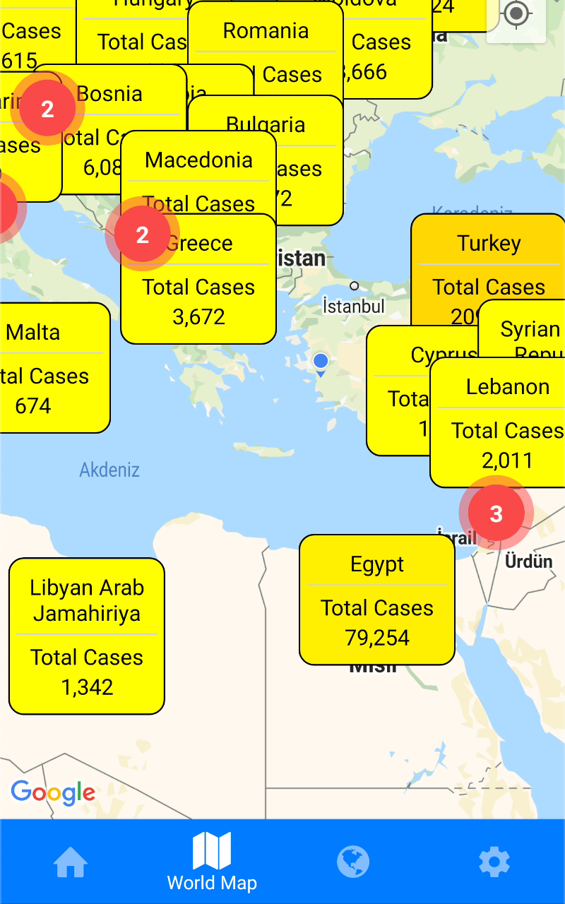
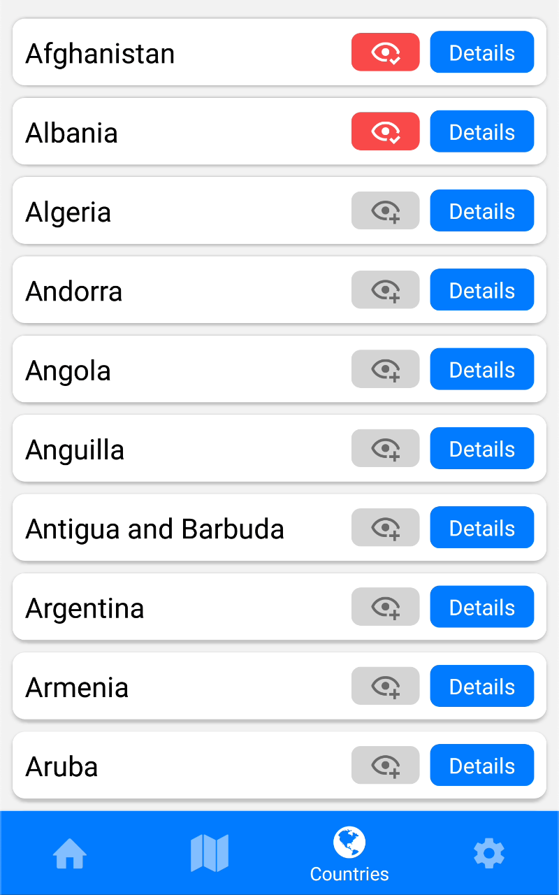
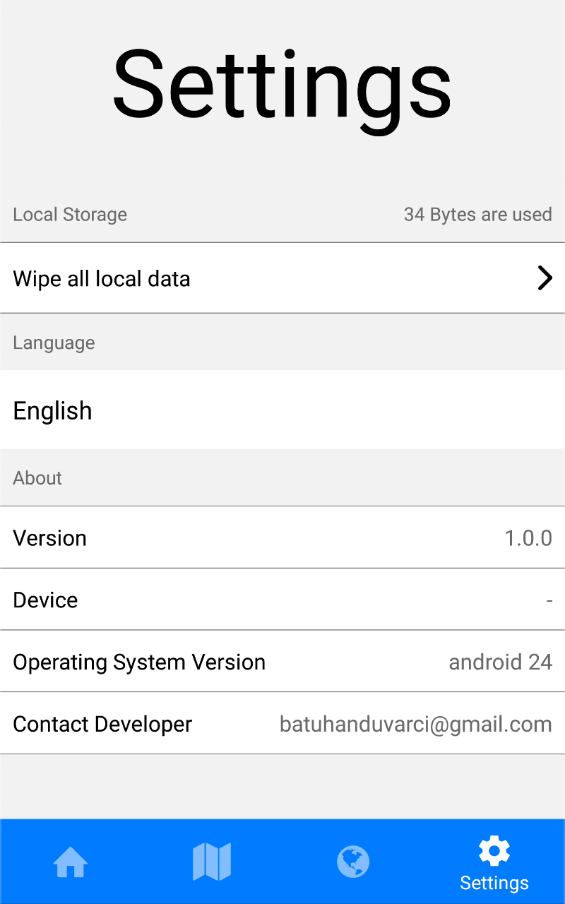
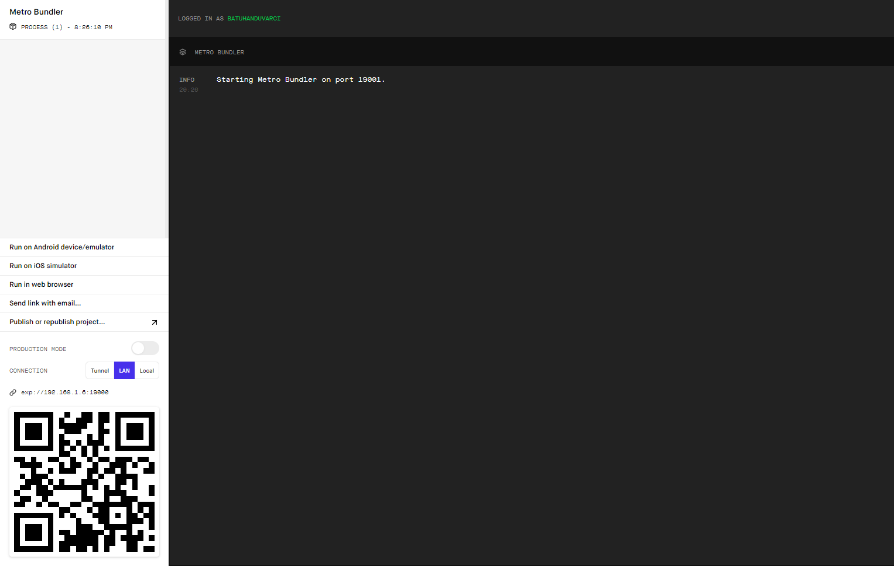

# corona-meter

Covid 19 tracking application build with React Native(Non-commercial)

This application is being developed with the help of [Expo.io](https://expo.io/)

<div align="center">





</div>

## How To Run

First of all [Node.js](https://nodejs.org/en/download/) must be installed on your system.Then, you must install the Expo CLI by writing below on your terminal.

```
npm install -g expo-cli
```

In next step, go to direction that you want to clone the project(You can download it via github as well).Run the command below.

```
git clone https://github.com/batuhanduvarci/corona-meter.git
```

Once you cloned the project, you should run the command below to install javascript packages which are used in this project.

```
npm install
```

In the next step, run the command below again :) to start the expo server on your local network.

```
expo start
```

After running command above, you will see a browser tab like below on your computer meaning that the server is ready.

<div align="center">

</div>

As final step, you should download expo app on Google Play Store or App Store depending on which platform you are on.Then, open the expo application and select "Scan QR Code"(This only works on Android).Once you scanned the QR code, the application package will be downloaded and you will be good to go.

## Application Features

- Global daily and total confirmed, recovered, deceases, active and critical cases
- Country daily and total confirmed, recovered, deceases, active and critical cases
- Fast Tracking

## Developers/Contributors

- [Batuhan DUVARCI](https://www.linkedin.com/in/batuhan-duvarci-562036155/)

## API's Used In This Project

- [Novel Covid Api](https://github.com/NovelCOVID/API)

## Libraries Used In This Project

- [axios](https://github.com/axios/axios)
- [buffer](https://github.com/feross/buffer)
- [i18n-js](https://github.com/fnando/i18n-js)
- [numeral](http://numeraljs.com)
- [react-native-map-clustering](https://github.com/venits/react-native-map-clustering#readme)
- [react-native-shimmer-placeholder](https://github.com/tomzaku/react-native-shimmer-placeholder#readme)
- [react-native-text-ticker](https://github.com/deanhet/react-native-text-ticker/)

## Any Suggestion or Feedback Would Be Appreciated

[batuhanduvarci@gmail.com](mailto:batuhanduvarci@gmail.com)
